**PRÁCTICA NLP**

**1. Descarga y exploración del corpus**

Detalle y explicaciones
¿Por qué elegimos este dataset?

Elegimos el dataset de Reviews de Apps de Android considerando la capacidad computacional local (MacBook Pro M1). Otro factor importante fue realizar un proyecto sobre un dataset sobre el que, a priori, no tuviésemos una idea preconcebida, y así poder explorar la información sin sesgos.
Análisis del número de palabras por review

Existe una importante asimetría con una larga cola hacia la izquierda. A medida que aumenta el número de palabras, disminuye la frecuencia de reviews.
La mayor concentración de reviews con pocas palabras se encuentra entre 0 y 50.

Podríamos usar esta información para configurar el parámetro max_len en modelos como RNN/LSTM, situándolo entre 90-100 palabras.

Hallar la cardinalidad del vocabulario 

La diferencia entre la cardinalidad con y sin stopwords indica una fuerte presencia de estas (más del 70%). Por tanto, hay una reducida carga semántica en el dataframe, lo cual sugiere que es recomendable aplicar las siguientes medidas:

    Limitar el número de tokens para reducir el ruido léxico (embeddings con límite de tokens).

    Utilizar Word2Vec para reducir las dimensiones semánticas.

    Analizar la redundancia.

    Emplear técnicas de regularización para evitar overfitting.

Distribución de reviews por número de estrellas

La distribución es discreta en cinco segmentos. Se encuentra bastante desbalanceada hacia puntuaciones positivas (4 y 5 estrellas).

Siguiendo las indicaciones, realizamos una transformación para plantear un problema binario en el que se prediga si las reseñas son positivas o negativas.

Dado que la distribución lo permite, optamos por eliminar el segmento de 3 estrellas y agrupar los dos segmentos de la izquierda (1-2) y los de la derecha (4-5). Así, consideramos valoraciones negativas (1-2) o positivas (4-5), desechando los valores centrales por no ser expresivos para este fin.


Nubes de palabras

Se realizó una visualización de datos (dataviz) considerando las palabras asociadas a cada clase.

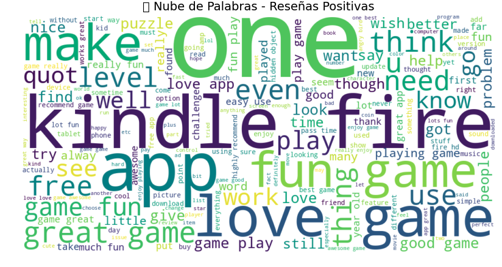


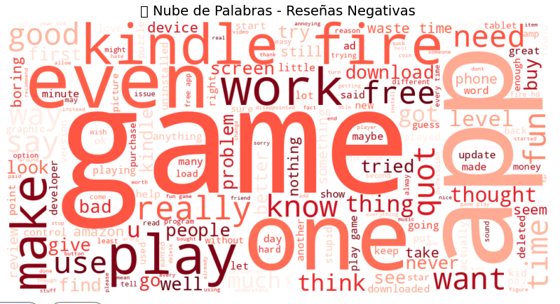


Visualización de Word Embeddings (5 palabras y visualización de las 10 más similares)

Se llevaron a cabo varios experimentos:

    ['love', 'work', 'need', 'even']: se emplearon palabras no principales (pueden no ser expresivas).


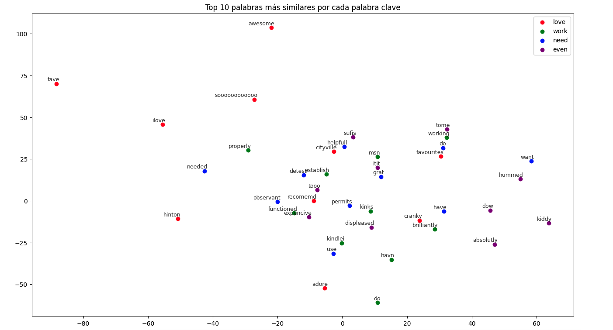
    

    Se usaron palabras más generales: ['love', 'game', 'well', 'app', ‘kindle’].


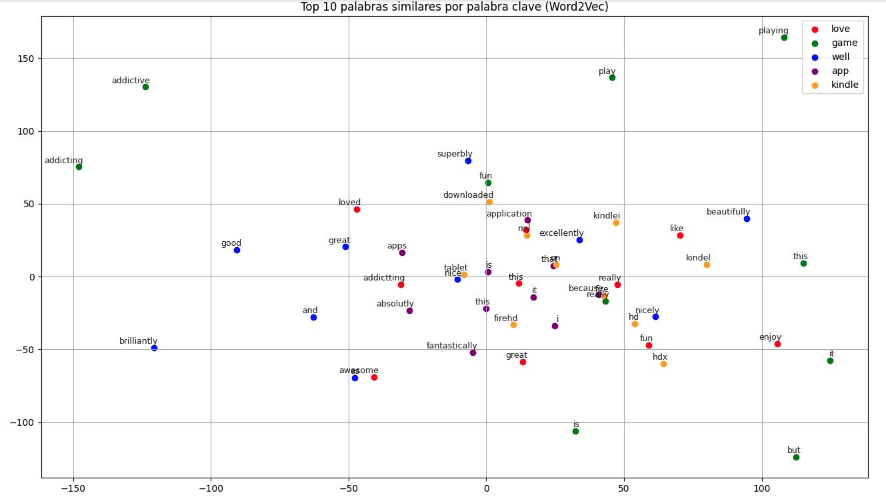
    

    Repetimos el experimento 2, pero sin stopwords: ['love', 'game', 'well', 'app', ‘kindle’].


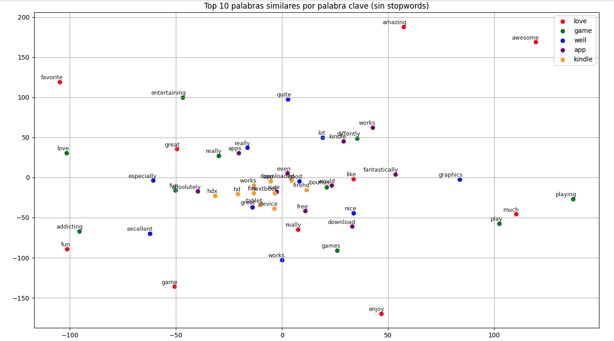
    

    Visualización con palabras asociadas a reseñas negativas: ['problem', 'waste', 'crash', 'disappointed', ‘bug’].


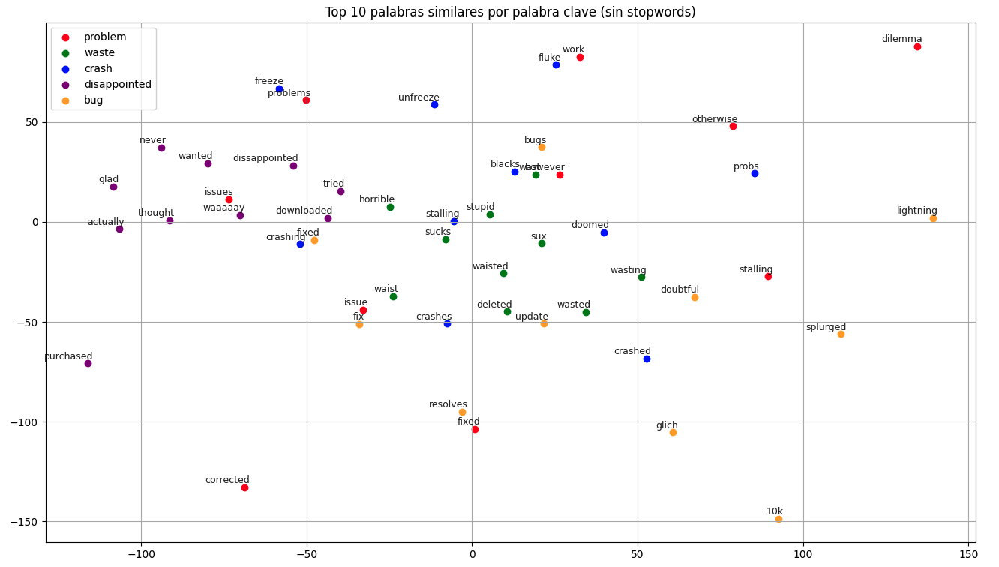
    

    Visualización con palabras asociadas a reseñas positivas: ['love', 'fun', 'great', 'awesome', ‘enjoy’].

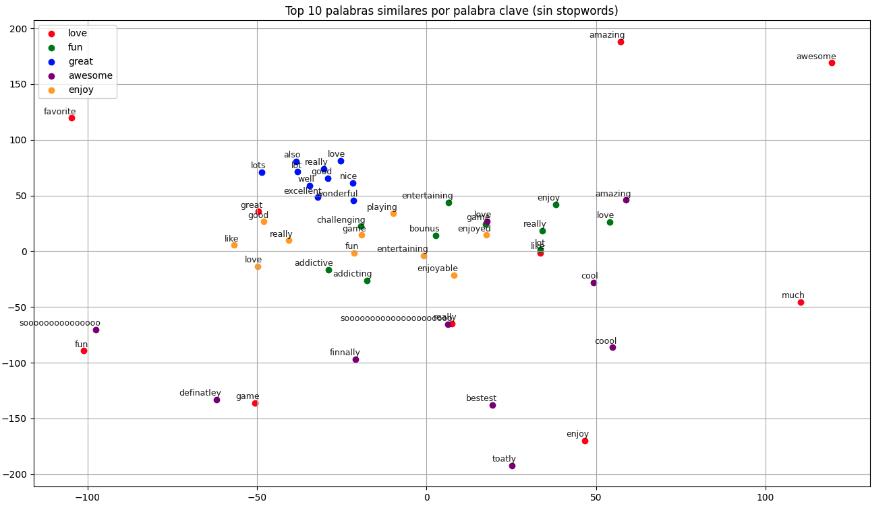


Análisis de la Ley de Zipf

Podemos observar que hay muchas palabras que aparecen solo una vez. Estas pueden generar dispersión y ruido.

Se puede emplear la frecuencia para filtrar las palabras, por ejemplo usando min_count=5.
También se puede regularizar el vocabulario para reducir el overfitting, por ejemplo con sample=1e-5.
Otra decisión fundamentada es reducir el número de palabras a 10.000, ya que estas capturan el 90% de la información.


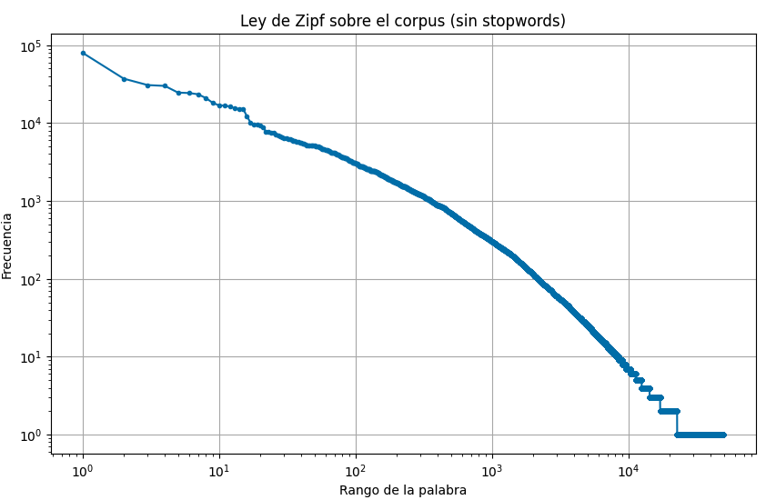


**2. Etapa de preprocesado de texto**

Se aporta el detalle de la estructura del código en Python modular, con funciones de preprocesado definidas.

```python
#Preprocesado agrupado por funciones 
import numpy as np
from tensorflow.keras.preprocessing.text import Tokenizer
from tensorflow.keras.preprocessing.sequence import pad_sequences
from sklearn.model_selection import train_test_split
import json

def preprocesar_y_split(df, text_col='review_clean', target_col='sentiment', vocab_size=10000, max_len=100, test_size=0.2, random_state=42):


    # Unificar tokens
    def tokens_a_texto(token_list):
        return ' '.join(token_list) if isinstance(token_list, list) else ''

    # Transformación corpus
    df['review_text_clean'] = df[text_col].apply(tokens_a_texto)

    # Eliminar reseñas vacías
    df['review_text_clean'].replace('', np.nan, inplace=True)
    df.dropna(subset=['review_text_clean'], inplace=True)
    df.reset_index(drop=True, inplace=True)

    # Tokenización y creación del vocabulario
    tokenizer = Tokenizer(num_words=vocab_size, oov_token='<OOV>')
    tokenizer.fit_on_texts(df['review_text_clean'])

    #Extra guardar tokenizador
    def guardar_tokenizer(tokenizer, ruta='tokenizer.json'):
        tokenizer_json = tokenizer.to_json()
        with open(ruta, 'w') as f:
          f.write(tokenizer_json)
        print(f"Tokenizer guardado en: {ruta}")


    # Convertir texto 
    sequences = tokenizer.texts_to_sequences(df['review_text_clean'])

    # Padding
    padded_sequences = pad_sequences(sequences, maxlen=max_len, padding='post', truncating='post')

    # Split estratificado
    X_train, X_test, y_train, y_test = train_test_split(
        padded_sequences,
        df[target_col].values,
        test_size=test_size,
        stratify=df[target_col],
        random_state=random_state
    )

    return X_train, X_test, y_train, y_test, tokenizer
```

**3. Etapa de entrenamiento y testeo de un modelo de análisis de sentimiento**

Se realizó un entrenamiento con un pipeline que permite emplear 4 modelos sencillos y comparar sus resultados.

**4. Reporte de métricas y conclusiones**

RNN

🔍 Métricas de evaluación

    Accuracy: 0.8114

    Precision: 0.8151

    Recall: 0.9940

    F1 Score: 0.8957

    ROC-AUC: 0.6546
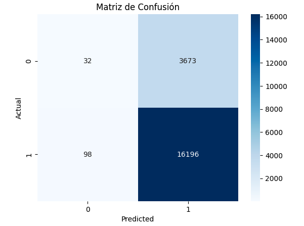


Tenemos un modelo con un accuracy aceptable, pero su capacidad para evitar falsos positivos es muy mejorable (Precisión: 0.81). Le cuesta identificar los verdaderos negativos, como indica la matriz de confusión, así como los falsos positivos. En definitiva, el modelo acusa un grave problema de desequilibrio: aprende un patrón muy sesgado.

LSTM

📈 Evaluando modelo: LSTM
625/625 ━━━━━━━━━━━━━━━━━━━━ 2s 3ms/step

🔍 Métricas de evaluación

    Accuracy: 0.9105

    Precision: 0.9381

    Recall: 0.9530

    F1 Score: 0.9455

    ROC-AUC: 0.9455
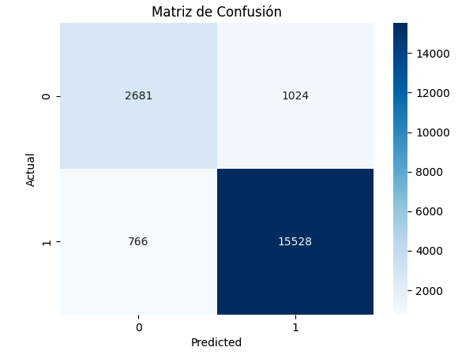

Mejora en general respecto al RNN. Se observa una mayor capacidad de generalización; en la matriz de confusión los valores son más equilibrados, mejorando notablemente en verdaderos negativos y falsos negativos. Los valores se muestran más estables y balanceados.

GRU

📈 Evaluando modelo: GRU
625/625 ━━━━━━━━━━━━━━━━━━━━ 2s 3ms/step

🔍 Métricas de evaluación

    Accuracy: 0.9021

    Precision: 0.9399

    Recall: 0.9400

    F1 Score: 0.9399

    ROC-AUC: 0.9385
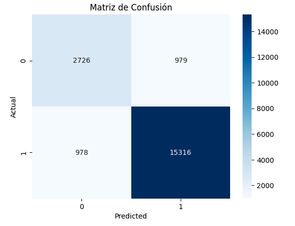

Empeora ligeramente respecto al LSTM, especialmente en los verdaderos negativos y los falsos negativos.

BiLSTM

📈 Evaluando modelo: BiLSTM
625/625 ━━━━━━━━━━━━━━━━━━━━ 3s 4ms/step

🔍 Métricas de evaluación

    Accuracy: 0.9042

    Precision: 0.9361

    Recall: 0.9471

    F1 Score: 0.9416

    ROC-AUC: 0.9321

Los resultados también son ligeramente más bajos que los del LSTM.

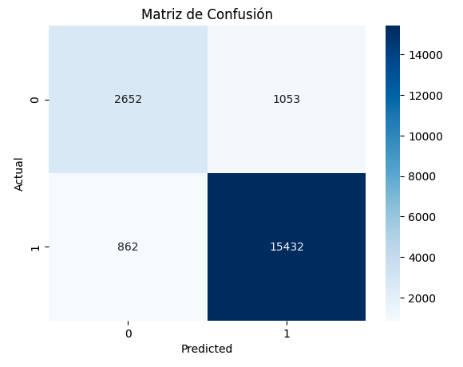

Conclusión:
El modelo más recomendable es LSTM, tanto por su nivel de precisión como por su capacidad para detectar verdaderos y falsos negativos. Sería el modelo ideal, salvo que se valoren los costes computacionales, ya que es el más exigente en este aspecto.


